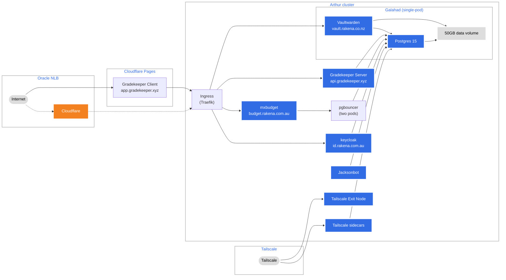

# Jackson's Kubernetes Configuration

This repository contains a complete Kustomize manifest that can bring up all of my self-hosted services, as well as an Traefik ingress and associated services.

This manifest does not make any assumptions about the environment it is deployed in. It is designed to be deployed to a fresh cluster. All resources are deployed in their own namespace (`production`/`canary`/`development`) to avoid collisions.	
  
The only items missing are secrets (`/production/secrets`) that are required to bring up the stack. These are not included for security reasons.

I do not intend for this repository to be used by anyone else (but feel free to use it as examples/learning), but if you do, you'll need to replace the secrets with your own.

#### Lists of thing to do
**Migrations**
- [x] Vaultwarden (https://vault.rakena.co.nz)
- [x] Jacksonbot (https://github.com/jacksonrakena/jacksonbot)
- [x] Gradekeeper API server (https://github.com/gradekeeper/server)
- [x] Use Kustomize
  - [x] Investigate using configMapGenerator and secretMapGenerator
- [ ] Investigate using Helm

## Production overview (`/production`)
The production stack performs the following:
1. Tags all resources with the `prod2` namespace.
2. Configures Traefik (`/production/traefik/`):
   1. Creates service accounts, roles, and bindings.
   2. Creates a Traefik deployment configured solely to run on port 443. (`/production/traefik/02-traefik.yml`)
   3. Creates a `LoadBalancer` service configured to an Oracle Cloud Network Load Balancer, and exposes port 443 to the Traefik deployment
      - Given that NGINX natively can perform the same tasks of the regular Load Balancer (TLS termination, virtual hosts, native load-balancing), there is no reason to use the regular (HTTP) Load Balancer over the Network Load Balancer.
      - Using the Network Load Balancer also allows us to receive and handle non-HTTP connections over our ingress, in the future.
      - This file must be updated if the claimed IP address changes.
      - This file also adjusts the cluster traffic policy to fix an issue where the Load Balancer couldn't reach nodes in the cluster.
3. Loads certificates from `/production/secrets/`
4. Loads other secrets from `/production/secrets/`
5. Imports the main generic app stack from `/stack`
6. Loads the production ingress table. (`/production/ingress.yml`)

### Secrets (`/production/secrets`)
This directory contains production-level secrets that the stack depends on.  
These secrets are excluded for security reasons.

| Name | Type | Expected value |
| ---- | ---- | -------------- |
| `galahad-pg` (galahad-secret.env) | Secret/Opaque | `db`, `username`, and `password` control the username and password for the Galahad Postgres instance. |
| `gh-container-registry` (docker-registry-config.json) | `kubernetes.io/dockerconfigjson` | Credentials for GitHub Container Registry |
| `gradekeeper-config` (gradekeeper-server.env) | ConfigMap | Contains a single file key of `.env` that contains valid [Gradekeeper server configuration](https://github.com/gradekeeper/server/blob/main/src/config.rs). |
| `jacksonbot-config` (jacksonbot-config.json) | ConfigMap | Contains a single file key of `jacksonbot.appsettings.json` that contains valid [Jacksonbot configuration](https://github.com/jacksonrakena/jacksonbot/blob/v20/jacksonbot.appsettings.example.json). |
| `rakena-cert` (cert-rakena.co.nz/tls.key, and cert.rakena.co.nz/tls.crt) | `kubernetes.io/tls` | Contains the certificate and key for `rakena.co.nz`. |
| `rakena-com-au-cert` (cert-rakena.co.nz/tls.key, and cert.rakena.co.nz/tls.crt) | `kubernetes.io/tls` | Contains the certificate and key for `rakena.com.au`. |

## Stack resources overview (`/stack`)
### Storage
#### arthur-global-data
- 50GB block volume (`PersistentVolumeClaim`)
- Stores Vaultwarden and PostgreSQL data
- Owned by Galahad

### Deployments
| Deployment name | Service | Information |
| --- | --- | --- |
| `apps/database/galahad` | Postgres 15, Vaultwarden | These services share the same data volume. |
| `apps/database/bouncer` | PGBouncer | Pools connections for some serverless apps running in the cluster.
| `apps/tailscale` | Tailscale | Configures a Tailscale operator and exit nodes. |
| `apps/identity` | Keycloak | Runs `id.rakena.com.au`.|
| `apps/jacksonbot` | [Jacksonbot](https://github.com/jacksonrakena/jacksonbot) | Runs Jacksonbot. |
| `apps/mxbudget` | [mx](https://github.com/jacksonrakena/mx) | |
| `apps/gradekeeper` | [gradekeeper-server](https://github.com/jacksonrakena/gradekeeper-server) | Runs the hosted Gradekeeper API server.

## Recipes
### Setup production
The production Kustomize file installs all necessary remote resources, so this recipe assumes an empty Kubernetes cluster.
```
kubectl create namespace prod2
```
#### Load balancer setup
You'll need to edit `production/traefik/02-traefik-services.yml` to have your Oracle Network Load Balancer settings:
```yaml
apiVersion: v1
kind: Service
metadata:
  name: traefik-service
  annotations:
    oci.oraclecloud.com/load-balancer-type: "nlb"
spec:
  loadBalancerIP: <YOUR_NETWORK_LOAD_BALANCER_IP_HERE>
  externalTrafficPolicy: Cluster
  type: LoadBalancer
  ports:
    - name: web-https
      port: 443
      targetPort: web-https
  selector:
    app: traefik
```

#### Bring everything up
Use Kustomize to automatically bring up all resources in order:
```
kubectl apply -k production
```

#### Force manifest synchronisation
###### (warning, this is dangerous)
To bring up all resources and delete **any** resource in the `production` namespace that is not in the manifest, use:
```
kubectl apply -k production --prune --all
```

## Utilities
### Prometheus and Grafana
This utility sets up Prometheus, Grafana, and some built-in cluster and namespace dashboards using [`kube-prometheus`](https://github.com/prometheus-operator/kube-prometheus). It doesn't set up any ingress tables, as it doesn't configure any persistence (so configuration settings would get erased at a pod restart). It exposes it over Tailscale, so if you have the Tailscale component configured, you can access it through the Tailscale DNS name.

Install:

```
kubectl apply -f utils/prometheus/
```
### Dashboard
- Install resources:
`kubectl apply -f https://raw.githubusercontent.com/kubernetes/dashboard/v2.7.0/aio/deploy/recommended.yaml`  
- Install accounts: `kubectl apply -f utils/dashboard.yml`
- Generate token: `kubectl create token admin-user -n kubernetes-dashboard`
- Proxy: `kubectl proxy`
- Access: http://localhost:8001/api/v1/namespaces/kubernetes-dashboard/services/https:kubernetes-dashboard:/proxy/

## Copyright
**&copy; 2023&mdash;2025 Jackson Rakena**  
Use is permitted for educational and personal purposes only.  
Commercial use is forbidden without written consent of the project author.
