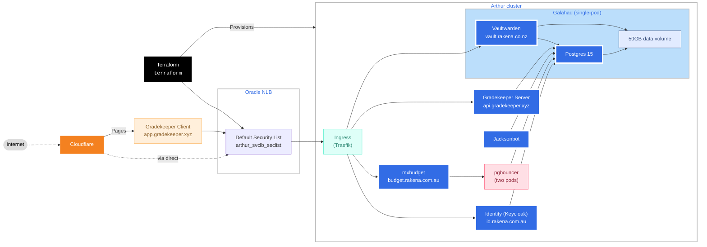

# Jackson's Cloud Infrastructure



This repository holds a variety of resources for bringing up all of my self-hosted services, including:

1. Terraform configuration for Oracle Cloud Infrastructure (OCI) that can provision a Kubernetes cluster and associated
   networking infrastructure
2. A `cdk8s` Kotlin project that can compile to a complete Kubernetes manifest for all resources running on-cluster
    1. This includes a Traefik ingest controller, and TLS certificate provisioning

This manifest does not make any assumptions about the environment it is deployed in. It is designed to be deployed to a
fresh cluster. All resources are deployed in their own namespace (`production`/`canary`/`development`) to avoid
collisions.

The only items missing are secrets (`/kube/secrets`) that are required to bring up the stack. These are not included for
security reasons.

I do not intend for this repository to be used by anyone else (but feel free to use it as examples/learning), but if you
do, you'll need to replace the secrets with your own.

## Infrastructure overview (`/terraform`)

This folder provisions the raw Kubernetes cluster and associated resources on Oracle Cloud Infrastructure (OCI).

| File                     | Role                                                                          |
|--------------------------|-------------------------------------------------------------------------------|
| `budget.tf`              | Configures OCI budget rules                                                   |
| `cluster.tf`             | Configures the OKE Cluster Engine resource and main node pool                 |
| `license_manager.tf`     | Configures OCI License Manager                                                |
| `networking.tf`          | Configures the VCN, route tables, and gateways for IGW/NAT                    |
| `networking_security.tf` | Configures the inter- and intra- node security lists and ingress/egress rules |
| `networking_subnets.tf`  | Configures the node, service, and control plane subnets                       |
| `provider.tf`            | Configures the OCI provider                                                   |

## Kubernetes overview (`/kube`)

The kube folder is a `cdk8s` Kotlin/Gradle project that creates a complete set of Kubernetes manifests in the
`/kube/dist` folder,
ready for sending to the cluster.

1. `ProductionRunner` creates the production namespace and `ProductionStack`.
2. `com.jacksonrakena.infrastructure.envs.prod.ProductionStack`:
    1. Loads credentials from a local directory as Kubernetes secrets and configmap resources
    2. Creates the global data volume (`ProductionBlockStorage`)
    3. Provisions all apps, linking them to credentials and the data volume as necessary
        1. Pgbouncer
            1. `ProductionStack` connects pgbouncer to the dynamically-generated Postgres service name.
        2. Gradekeeper Server
        3. Keycloak (Identity)
        4. Jacksonbot
        5. Mixer & mxbudget
    4. Configures Traefik resources (`com.jacksonrakena.infrastructure.traefik.TraefikStack`):
        1. Creates service accounts, roles, and bindings.
        2. Creates a Traefik deployment configured solely to run on port 443. (`/production/traefik/02-traefik.yml`)
        3. Creates a `LoadBalancer` service configured to an Oracle Cloud Network Load Balancer, and exposes port 443 to
           the
           Traefik deployment
            - Given that NGINX natively can perform the same tasks of the regular Load Balancer (TLS termination,
              virtual
              hosts, native load-balancing), there is no reason to use the regular (HTTP) Load Balancer over the Network
              Load Balancer.
            - Using the Network Load Balancer also allows us to receive and handle non-HTTP connections over our
              ingress, in
              the future.
    5. Creates a Traefik instance with the production routing table.

### Secrets (`/kube/secrets`)

This directory contains production-level secrets that the stack depends on.  
These secrets are excluded for security reasons.

| Name                                                                            | Type                             | Expected value                                                                                                                                                                                        |
|---------------------------------------------------------------------------------|----------------------------------|-------------------------------------------------------------------------------------------------------------------------------------------------------------------------------------------------------|
| `galahad-pg` (galahad-secret.env)                                               | Secret/Opaque                    | `db`, `username`, and `password` control the username and password for the Galahad Postgres instance.                                                                                                 |
| `gh-container-registry` (docker-registry-config.json)                           | `kubernetes.io/dockerconfigjson` | Credentials for GitHub Container Registry                                                                                                                                                             |
| `gradekeeper-config` (gradekeeper-server.env)                                   | ConfigMap                        | Contains a single file key of `.env` that contains valid [Gradekeeper server configuration](https://github.com/gradekeeper/server/blob/main/src/config.rs).                                           |
| `jacksonbot-config` (jacksonbot-config.json)                                    | ConfigMap                        | Contains a single file key of `jacksonbot.appsettings.json` that contains valid [Jacksonbot configuration](https://github.com/jacksonrakena/jacksonbot/blob/v20/jacksonbot.appsettings.example.json). |
| `rakena-cert` (cert-rakena.co.nz/tls.key, and cert.rakena.co.nz/tls.crt)        | `kubernetes.io/tls`              | Contains the certificate and key for `rakena.co.nz`.                                                                                                                                                  |
| `rakena-com-au-cert` (cert-rakena.co.nz/tls.key, and cert.rakena.co.nz/tls.crt) | `kubernetes.io/tls`              | Contains the certificate and key for `rakena.com.au`.                                                                                                                                                 |

## Recipes

#### Load balancer setup

You'll need to edit `com.jacksonrakena.infrastructure.traefik.TraefikStack` to have your Oracle Network Load Balancer
settings.

#### Bring everything up

Use Terraform to provision infrastructure:

```
terraform apply
```

Use `cdk8s` and `kubectl` to automatically bring up all resources in order:

```
cd kube
cdk8s import
cdk8s synth
kubectl apply -f dist
```

#### Force manifest synchronisation

###### (warning, this is dangerous)

To bring up all resources and delete **any** resource in the `prod` namespace that is not in the manifest, use:

```
kubectl apply -f dist --prune --all
```

## Copyright

**&copy; 2023&mdash;2025 Jackson Rakena**  
Use is permitted for educational and personal purposes only.  
Commercial use is forbidden without written consent of the project author.
