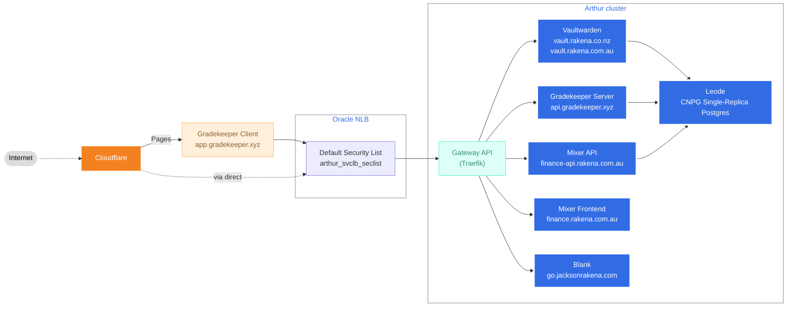

# Jackson's Cloud Infrastructure


```mermaid
flowchart LR
 subgraph cf_tls["Oracle NLB"]
        vsec["Default Security List<br>arthur_svclb_seclist"]
  end

 subgraph cluster["Arthur cluster"]
      pg["Leode<br>CNPG Single-Replica Postgres"]
        ingress["Gateway API<br>(Traefik)"]
        vw["Vaultwarden<br>vault.rakena.co.nz<br>vault.rakena.com.au"]
        gk["Gradekeeper Server<br>api.gradekeeper.xyz"]
        mx["Mixer API<br>finance-api.rakena.com.au"]
        mxf["Mixer Frontend<br>finance.rakena.com.au"]
        bl["Blank<br>go.jacksonrakena.com"]
  end
    client(["Internet"]) -..-> cf["Cloudflare"]
    gk_frontend["Gradekeeper Client<br>app.gradekeeper.xyz"] --> vsec
    cf -. via direct ..-> vsec
    vsec --> ingress
    ingress --> gk & vw & mx & mxf & bl
    vw --> pg
    gk --> pg
    mx --> pg
    cf -- Pages --> gk_frontend
     vw:::k8s
     pg:::k8s
     ingress:::Aqua
     gk:::k8s
     mx:::k8s
     mxf:::k8s
     bl:::k8s
     client:::plain
     cf:::cloudflare
     cluster:::cluster
     gk_frontend:::Peach
    classDef plain fill:#ddd,stroke:#fff,stroke-width:4px,color:#000
    classDef k8s fill:#326ce5,stroke:#fff,stroke-width:4px,color:#fff
    classDef cluster fill:#fff,stroke:#bbb,stroke-width:2px,color:#326ce5
    classDef cloudflare fill:#F48120,stroke:#F48120,stroke-width:2px,color:white
    classDef Class_01 fill:#000000, color:#fff, stroke:#000000
    classDef Sky stroke-width:1px, stroke-dasharray:none, stroke:#374D7C, fill:#E2EBFF, color:#374D7C
    classDef Peach stroke-width:1px, stroke-dasharray:none, stroke:#FBB35A, fill:#FFEFDB, color:#8F632D
    classDef Aqua stroke-width:1px, stroke-dasharray:none, stroke:#46EDC8, fill:#DEFFF8, color:#378E7A
    classDef Rose stroke-width:1px, stroke-dasharray:none, stroke:#FF5978, fill:#FFDFE5, color:#8E2236
```

This repository holds a variety of resources for bringing up all of my self-hosted services, including a `cdk8s` TypeScript project that can compile to a complete Kubernetes manifest for all resources running on-cluster. This includes a Traefik ingest controller, and TLS certificate provisioning.

This manifest does not make any assumptions about the environment it is deployed in. It is designed to be deployed to a
fresh cluster. All resources are deployed in the `prod` namespace to avoid collisions.

The only items missing are secrets (`/secrets`) that are required to bring up the stack. These are not included for
security reasons.

I do not intend for this repository to be used by anyone else (but feel free to use it as examples/learning), but if you
do, you'll need to replace the secrets with your own.


## Kubernetes overview

This is  TypeScript project that creates a complete set of Kubernetes manifests in the
`/dist` folder,
ready for sending to the cluster.

1. `ProductionRunner` creates the `prod` namespace, includes the upstream Gateway API, CloudNativePG, and Traefik Gateway RBAC manifests, and instantiates `ProductionStack`.
2. `ProductionStack` (`src/envs/prod/production-stack.ts`):
    1. Loads credentials from a local directory as Kubernetes secrets and configmap resources
       - **Possible improvement** - use Oracle secret management instead of raw Kubernetes secrets
    2. Creates the global data volume (`ProductionBlockStorage`)
       - This was used by several apps in the past, but is currently only used by Vaultwarden. It is massively overprovisioned (50GiB) due to the minimum volume size set by Oracle Cloud
    3. Provisions the `Leode` CloudNativePG Postgres cluster, with managed roles and per-app databases
       - This single cluster is used by all apps that require a Postgres database
       - This cluster is only configured `instances: 1`, as each instance needs a dedicated volume, and the Oracle free tier only allows 200 GiB (global data volume 50 GiB + 2 boot volumes for Kube nodes @ 50 GiB each + 1 Leode instance @ 50 GiB = 200 GiB total).
         - During Kubernetes cluster maintenance, I usually scale up to 2 instances (primary + replica) for zero-downtime failover, then scale back down to 1 (primary only) after maintenance is complete.
    4. Provisions all apps, linking them to credentials, the Postgres cluster, and the data volume as necessary
        1. Vault [dani-garcia/vaultwarden](https://github.com/dani-garcia/vaultwarden)
        2. Gradekeeper Server (API) [jacksonrakena/gradekeeper](https://github.com/jacksonrakena/gradekeeper)
        3. Mixer (API and frontend) [jacksonrakena/mixer](https://github.com/jacksonrakena/mixer)
        4. Blank [jacksonrakena/blank](https://github.com/jacksonrakena/blank)
    5. Configures Traefik resources (`src/traefik/traefik-stack.ts`):
        1. Creates service accounts, cluster roles, and bindings.
        2. Creates a Traefik deployment configured solely to run on port 443, with the Kubernetes Gateway provider enabled.
           - This operates in controller mode providing the Gateway API controller
           - Also creates a `LoadBalancer` service annotated for an Oracle Cloud Network Load Balancer (NLB)
             - Traefik + Gateway API can do all the functions of a normal Oracle Load Balancer, so there is no need to use one. NLB is included in the free tier.
        3. Registers a `GatewayClass` for the `traefik.io/gateway-controller`.
    6. Creates a Gateway API `Gateway` terminating TLS for `rakena.co.nz`, `rakena.com.au`, and `jacksonrakena.com`, and an `HTTPRoute` per hostname pointing at the appropriate backing service.
        - **Improvement** - automate the Cloudflare SSL cert retrieval + improve code structure around routing (move the routes into app ownership)

### Secrets (`/secrets`)

This directory contains production-level secrets that the stack depends on.  
These secrets are excluded for security reasons.

| Name                                                                                      | Type                             | Expected value                                                                                                                                                                 |
| ----------------------------------------------------------------------------------------- | -------------------------------- | ------------------------------------------------------------------------------------------------------------------------------------------------------------------------------ |
| `vault-secret` (vaultwarden.env)                                                          | Secret/Opaque                    | Environment variables for the Vaultwarden deployment, loaded as `key=value` lines.                                                                                             |
| `gh-container-registry` (docker-registry-config.json)                                     | `kubernetes.io/dockerconfigjson` | Credentials for GitHub Container Registry.                                                                                                                                     |
| `gradekeeper-config` (gradekeeper-server.env)                                             | ConfigMap                        | Contains a single file key of `.env` that contains valid [Gradekeeper server configuration](https://github.com/gradekeeper/server/blob/main/src/config.rs).                    |
| `mixer-backend-config` (mixer.backend.env)                                                | ConfigMap                        | Environment variables for the Mixer API deployment, loaded as `key=value` lines.                                                                                               |
| `blank-config` (go_targets.kdl)                                                           | ConfigMap                        | A single `targets.kdl` file containing the redirect target list for the Blank deployment.                                                                                      |
| `pg-users/<app>.properties`                                                               | Secret/`basic-auth`              | Per-app `username` and `password` properties files (`gradekeeper`, `mixer`) used to materialise CloudNativePG managed roles and the secrets each app uses to connect to Leode. |
| `rakena-co-nz-cert` (cert-rakena.co.nz/tls.key, cert-rakena.co.nz/tls.crt)                | `kubernetes.io/tls`              | Contains the certificate and key for `rakena.co.nz`.                                                                                                                           |
| `rakena-com-au-cert` (cert-rakena.com.au/tls.key, cert-rakena.com.au/tls.crt)             | `kubernetes.io/tls`              | Contains the certificate and key for `rakena.com.au`.                                                                                                                          |
| `jacksonrakena-com-cert` (cert-jacksonrakena.com/tls.key, cert-jacksonrakena.com/tls.crt) | `kubernetes.io/tls`              | Contains the certificate and key for `jacksonrakena.com`.                                                                                                                      |

## Recipes

#### Load balancer setup

You'll need to edit `src/traefik/traefik-stack.ts` to have your Oracle Network Load Balancer
settings.

#### Bring everything up

Use `cdk8s` and `kubectl` to automatically bring up all resources in order:

```
npm run build
kubectl apply -f dist
```

#### Force manifest synchronisation

###### (warning, this is dangerous)

To bring up all resources and delete **any** resource in the `prod` namespace that is not in the manifest, use:

```
kubectl apply -f dist --prune --all
```

## Copyright

**&copy; 2023&mdash;2026 Jackson Rakena**  
Use is permitted for educational and personal purposes only.  
Commercial use is forbidden without written consent of the project author.
