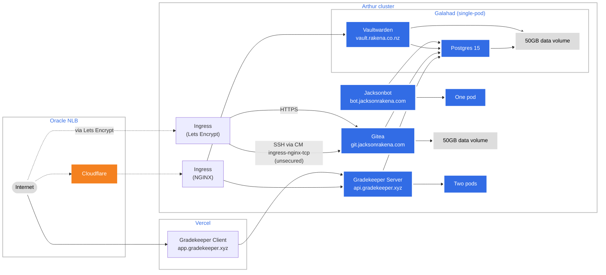

# Jackson's Kubernetes Configuration

This repository contains a complete Kustomize manifest that can bring up all of my self-hosted services, as well as an NGINX ingress (+ controller) and associated services.

This manifest does not make any assumptions about the environment it is deployed in. It is designed to be deployed to a fresh cluster. All resources are deployed in their own namespace (`production`/`canary`/`development`) to avoid collisions.	
  
The only items missing are secrets (`/production/secrets`) that are required to bring up the stack. These are not included for security reasons.

I do not intend for this repository to be used by anyone else (but feel free to use it as examples/learning), but if you do, you'll need to replace the secrets with your own.

#### Lists of thing to do
**Migrations**
- [x] Vaultwarden (https://vault.rakena.co.nz)
- [x] Jacksonbot (https://github.com/jacksonrakena/jacksonbot)
- [x] Gradekeeper API server (https://github.com/gradekeeper/server)

**Future**
- [x] Use Kustomize
  - [x] Investigate using configMapGenerator and secretMapGenerator
- [ ] Investigate using Helm

## Production overview (`/production`)
The production stack performs the following:
1. Tags all resources with the `production` namespace.
2. Tags all resources with `author=jacksonrakena` and `release=production` metdata.
3. Imports the production NGINX controller from `/production/nginx`
4. Loads certificates from `/production/secrets/`
5. Loads other secrets from `/production/secrets/`
6. Imports the main generic app stack from `/stack`
7. Loads the production ingress table.

### NGINX controller (`/production/nginx`)
- Installs the NGINX Ingress controller from a remote source.
- Update this file to update the NGINX Ingress controller version.
- `nlb-patch` patches the controller to request a Network Load Balancer from Oracle instead of a Load Balancer (it's cheaper)
  - Given that NGINX natively can perform the same tasks of the regular Load Balancer (TLS termination, virtual hosts, native load-balancing), there is no reason to use the regular (HTTP) Load Balancer over the Network Load Balancer.
  - Using the Network Load Balancer also allows us to receive and handle non-HTTP connections over our ingress, in the future.
  - This file must be updated if the claimed IP address changes.
  - This file also adjusts the cluster traffic policy to fix an issue where the Load Balancer couldn't reach nodes in the cluster.
### Secrets (`/production/secrets`)
This directory contains production-level secrets that the stack depends on.  
These secrets are excluded for security reasons.

| Name | Type | Expected value |
| ---- | ---- | -------------- |
| `galahad-pg` (galahad-secret.env) | Secret/Opaque | `db`, `username`, and `password` control the username and password for the Galahad Postgres instance. |
| `gh-container-registry` (docker-registry-config.json) | `kubernetes.io/dockerconfigjson` | Credentials for GitHub Container Registry |
| `gradekeeper-config` (gradekeeper-server.env) | ConfigMap | Contains a single file key of `.env` that contains valid [Gradekeeper server configuration](https://github.com/gradekeeper/server/blob/main/src/config.rs). |
| `jacksonbot-config` (jacksonbot-config.json) | ConfigMap | Contains a single file key of `jacksonbot.appsettings.json` that contains valid [Jacksonbot configuration](https://github.com/jacksonrakena/jacksonbot/blob/v20/jacksonbot.appsettings.example.json). |
| `rakena-cert` (cert-rakena.co.nz/tls.key, and cert.rakena.co.nz/tls.crt) | `kubernetes.io/tls` | Contains the certificate and key for `rakena.co.nz`. |

## Stack resources overview (`/stack`)
### Storage
#### arthur-global-data
- 50GB block volume (`PersistentVolumeClaim`)
- Stores Vaultwarden and PostgreSQL data
- Owned by Galahad

### Deployments
#### apps/galahad
- Galahad is the deployment that controls access to the Arthur primary data block volume (`arthur-global-data`.yml)
- Limited to 1 replica due to the nature of the data it controls
- Runs Vaultwarden as it needs data access
- Runs PostgreSQL as it needs data access

#### apps/jacksonbot
- Runs Jacksonbot.
- Depends on Galahad
- Recreate strategy (only ever one pod running)
#### apps/gradekeeper-server
- Runs the Gradekeeper server.
- Depends on Galahad.
- 2 replicas, 1 max unavailable
- Pulls the Docker image from the GitHub container registry

## Recipes
### Setup production
The production Kustomize file installs all necessary remote resources, so this recipe assumes an empty Kubernetes cluster.
#### Load balancer setup
You'll need to edit `production/nginx/nlb-patch.yml` to have your Oracle Load Balancer settings:
```yaml
$patch: merge
apiVersion: v1
kind: Service
metadata:
  name: required-for-kustomize-but-not-used
  annotations:
    oci.oraclecloud.com/load-balancer-type: "nlb"
spec:
  loadBalancerIP: YOUR CLAIMED IP ADDRESS HERE
  externalTrafficPolicy: Cluster
```

#### Bring everything up
Use Kustomize to automatically bring up all resources in order:
```
kubectl apply -k production
```

#### Force manifest synchronisation
###### (warning, this is dangerous)
To bring up all resources and delete **any** resource in the `production ` namespace that is not in the manifest, use:
```
kubectl apply -k production --prune --all
```

## Utilities
### Dashboard
- Install resources:
`kubectl apply -f https://raw.githubusercontent.com/kubernetes/dashboard/v2.7.0/aio/deploy/recommended.yaml`  
- Install accounts: `kubectl apply -f /utils/dashboard.yml`
- Generate token: `kubectl create token admin-user -n kubernetes-dashboard`
- Proxy: `kubectl proxy`
- Access: http://localhost:8001/api/v1/namespaces/kubernetes-dashboard/services/https:kubernetes-dashboard:/proxy/

## Copyright
**&copy; 2023 Jackson Rakena**  
Use is permitted for educational and personal purposes only.  
Commercial use is forbidden without written consent of the project author.
